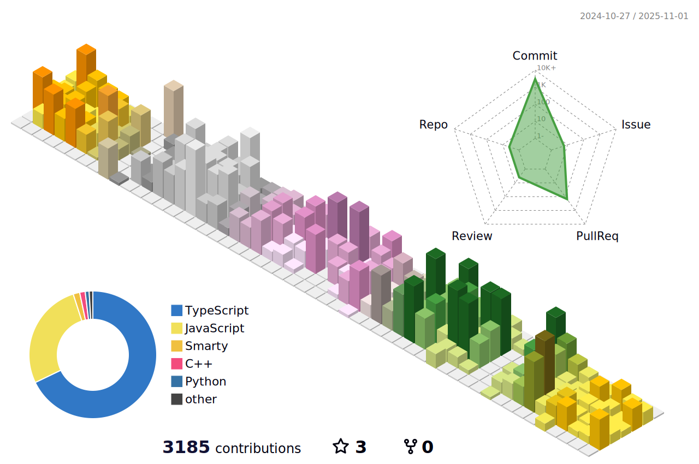

## Hello I'm Samuele Ferri! 👋

Software Engineer graduated in in the master’s course of Computer Science Engineering at the University of Bergamo.

### About me

:compass: [samuelexferri.com](https://www.samuelexferri.com)

:key: GPG Fingerprint: _CD13 9D76 003F 5A04 A43F 7D10 EBB3 DDAA EE1E 4362_ ([Download](https://samuelexferri.com/CD139D76003F5A04A43F7D10EBB3DDAAEE1E4362.asc))

### Stats

<!--START_SECTION:waka-->
**🐱 My GitHub Data** 

> 📦 1.6 MB Used in GitHub's Storage 
 > 
> 🏆 163 Contributions in the Year 2025
 > 
> 💼 Opted to Hire
 > 
> 📜 17 Public Repositories 
 > 
> 🔑 25 Private Repositories 
 > 

 Last Updated on 02/02/2025 12:23:23 UTC
<!--END_SECTION:waka-->

